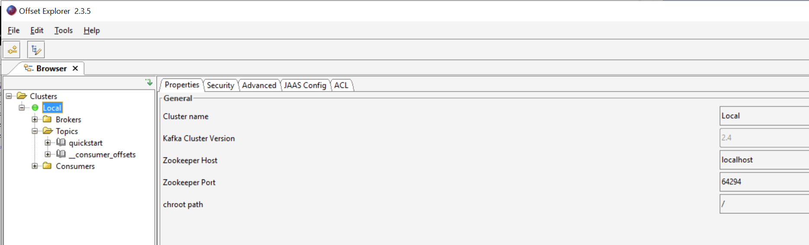
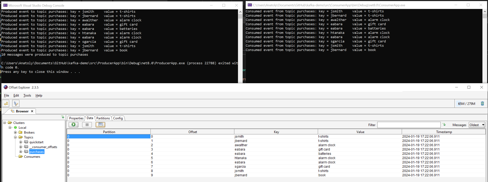

# kafka-demo

Simple demo with Kafka

- [Getting Started with Apache Kafka and .NET](https://developer.confluent.io/get-started/dotnet/)

## Setup

### Install Docker Desktop

- [Docker Desktop](https://docs.docker.com/desktop/)

### Install Confluent CLI

- [Confluent CLI](https://github.com/confluentinc/cli/releases/latest)

#### Start Kafka

```
confluent local kafka start
```

#### Create a topic

```
confluent local kafka topic create quickstart
```

#### Write messages to the topic

```
confluent local kafka topic produce quickstart
```

#### Read messages from the topic

```
confluent local kafka topic consume quickstart --from-beginning
```

#### Stop the Kafka broker

```
confluent local kafka stop
```

### Install Offset Explorer (formerly Kafka Tool)

- [Offset Explorer](https://www.kafkatool.com/download.html)




### Demo

#### Run solution


